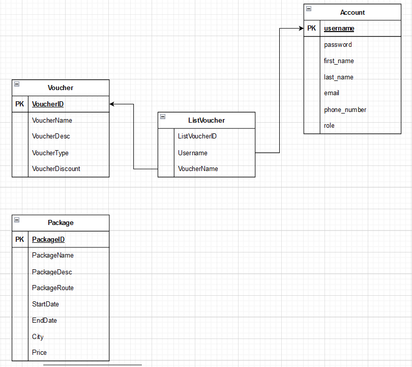

# travelution-rest

## Deskripsi
travelution-rest adalah backend dari aplikasi travelution (khususnya travelution premium). Aplikasi ini dibuat dengan menggunaan Express + MySQL. Aplikasi ini dibuat untuk memenuhi tugas besar mata kuliah Pemrograman Aplikasi Berbasis Web.

## Overview Feature

- Express with Typescript based app
- Auth utilizing JWT
- MySQL as database
- Dockerized
- SOAP calls to travelution-soap

## Skema basis data
Basis data terdiri atas 4 tabel, yaitu tabel package, tabel voucher, tabel pengguna, dan tabel kepemilikan voucher dari pengguna. Untuk kepemilikan voucher ada foreign key menuju tabel pengguna dan voucher.

## Daftar endpoint
GET /profile, 
POST /login, 
POST /logout,
POST /register, 
GET /user-voucher.id
GET /user-voucher
DELETE /user-voucher.id
GET /voucher
GET /voucher.id
POST /voucher
DELETE /voucher.id
GET /package
GET /package.id
PUT /package.id
DELETE /package.id
POST /package
GET /package-place.id
POST /package-place
DELETE /package-place.id
DELETE /package-place.placeid
POST /decode

## Cara menjalankan aplikasi
1. Pastikan sudah terinstall NodeJS, MySQL, dan Docker
2. Clone repositori ini
3. Buat file `.env` pada root folder aplikasi mengikuti contoh .env.example
4. Lakukan `docker compose up --build` dan `docker compose up`

## Pembagian Tugas
1. CRUD: 13521029
2. GET list Subscriber: 13521029
3. GET list Voucher: 13521029
4. Validate Subscriber: 13521029
5. Validate Voucher: 13521029
6. Accept/Reject Subscriber: 13521003
7. Database: 13521008
